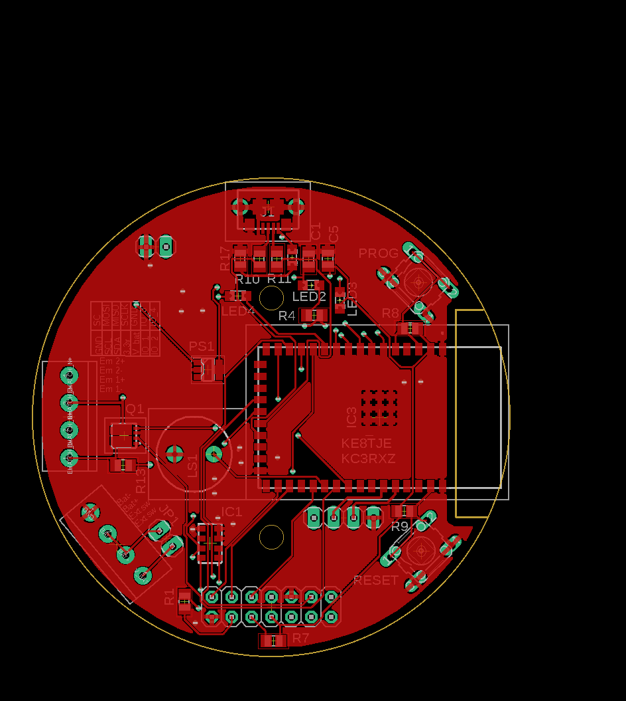
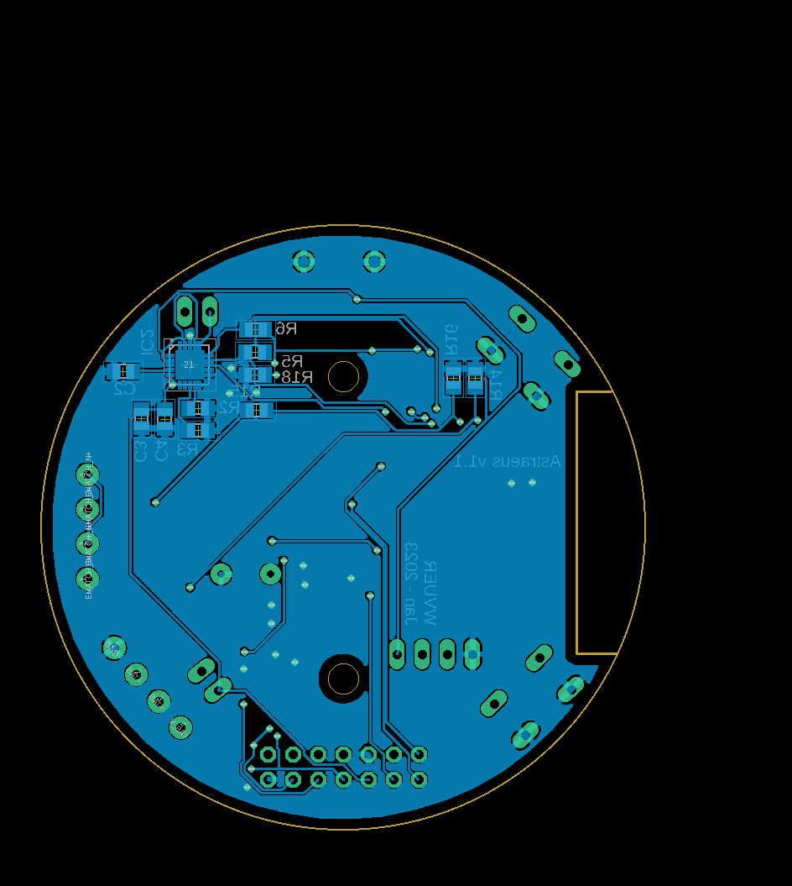

# Astraeus

This is the github repo of the West Virginia University SRAD avionics project named Astraeus.

Astreaus is a student led project to develop cheap, open-source, and modular avionics. The goal is to create electronics for our competition rocket and for student use on personal rockets. 

Astraeus is the greek god of the wind and dusk to match not only the idea of our avionics being on a rocket but also our competition rocket being named "Dark and Dusty" after the song Country Roads 

# Final Design 
## Top Side


## Bottom Side 



# PCB

EAGLE is used as the PCB designing software. All the libraries needed is included in `./PCB/lib`

- if you are on linux. Use the following command to make a sim links to the default eagle save directory  

```
cd ~/EAGLE/projects
ln -s ~/Projects/Astraeus/PCB/ git-pcb
```

- if you are on windows 10: Add instructions on how to get EAGLE running

# TO-DO

- [x] Initial planning and requirement gathering.
- [x] Finalizing the hardware specification.
- [x] Schematic design
  - [x] BMS
  - [x] voltage regulation
  - [x] Sensors
  - [x] USB
  - [ ] upload/download
  - [ ] SD card
